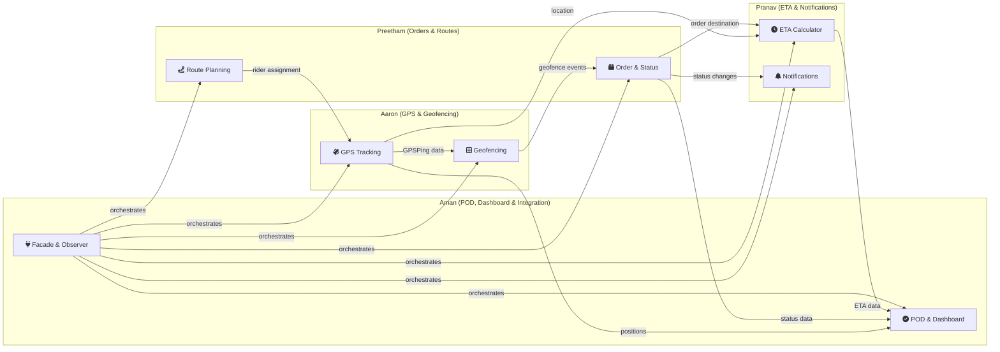

# 🍜 Ramen Noodles — Task Division & File Ownership
## Real-Time Delivery Monitoring | OOAD Lab Project

---

## 📐 Division Philosophy

Each team member owns **2 functionalities** that are:
- **Self-contained** — each functionality can be developed & tested independently
- **Merge-safe** — files don't overlap, so Git branches won't conflict
- **Interface-driven** — functionalities communicate via shared models & the Observer event system, not direct calls

> [!IMPORTANT]
> **Shared Foundation:** All 6 enum files (`enums/`) and `model/Coordinate.java` are shared utilities created once at project start. Whoever finishes first pushes these to `main`. After that, **nobody edits them** without team agreement. These are the only "common" files.

---

## 👥 Team Assignment Overview

| Person | Functionality 1 | Functionality 2 | Total Files | Total Lines |
|--------|----------------|-----------------|-------------|-------------|
| **Aaron Thomas Mathew** | GPS Tracking & Device Mgmt | Geofencing Engine | 10 | ~487 |
| **Preetham V J** | Order Lifecycle & Status Mgmt | Route Planning & Rider Assignment | 9 | ~512 |
| **G. Pranav Ganesh** | ETA Calculation & Prediction | Customer Notification Gateway | 10 | ~388 |
| **Aman Kumar Mishra** | Proof of Delivery & Fleet Dashboard | Integration, Events & Orchestration | 12 | ~1,155 |

---

## 🔵 Aaron Thomas Mathew — GPS & Geofencing

### Functionality 1: Live GPS Tracking & Device Management
> Handles all real-time location data — device registration, GPS ping processing, location history.

| File | Package | Lines | Description |
|------|---------|-------|-------------|
| `Rider.java` | `model/` | 63 | Rider entity (profile, status, device registration) |
| `Device.java` | `model/` | 55 | GPS device attached to rider's vehicle |
| `GPSPing.java` | `model/` | 56 | Single GPS location data point (append-only) |
| `GPSTrackingService.java` | `service/` | 90 | Core GPS service — processes pings, stores locations |
| `RiderStatus.java` | `enums/` | 18 | Rider availability states |

**Key methods to implement:**
- `processGPSPing(deviceId, lat, lng)` → the heartbeat of the tracking system
- `getLatestPing(riderId)` → used by ETA and Dashboard (other team members)
- `registerDevice(riderId)` → pairs a GPS device to a rider

**Publishes events:** `LOCATION_UPDATED`
**Consumed by:** Pranav (ETA calculation), Aman (Dashboard, Facade)

---

### Functionality 2: Geofencing Engine
> Manages virtual geographic boundaries and detects entry/exit events.

| File | Package | Lines | Description |
|------|---------|-------|-------------|
| `GeofenceZone.java` | `model/` | 65 | Virtual boundary definition (center + radius) |
| `GeofenceEvent.java` | `model/` | 46 | Entry/exit trigger event record (append-only) |
| `GeofencingService.java` | `service/` | 115 | Checks GPS pings against zones, triggers events |
| `ZoneType.java` | `enums/` | 18 | PICKUP, DROPOFF, WAREHOUSE, RESTRICTED |
| `EventType.java` | `enums/` | 16 | ENTRY, EXIT |

**Key methods to implement:**
- `createZonesForOrder(order, radius)` → sets up pickup & dropoff geofences
- `checkGeofences(orderId, riderId, lat, lng)` → the core detection logic
- `isPointInside(lat, lng)` → uses Haversine distance formula from `Coordinate`

**Publishes events:** `GEOFENCE_ENTRY`, `GEOFENCE_EXIT`
**Consumed by:** Preetham (auto-triggers status changes), Aman (Facade)

---

### 🔀 Git Branch Strategy for Aaron
```
main
 └── feature/gps-tracking       ← Work on Functionality 1
 └── feature/geofencing          ← Work on Functionality 2
```

---

## 🟢 Preetham V J — Orders & Routes

### Functionality 3: Order Lifecycle & Status Management
> Manages the complete order lifecycle with validated state transitions and an immutable audit trail.

| File | Package | Lines | Description |
|------|---------|-------|-------------|
| `Order.java` | `model/` | 85 | Core order entity (customer, rider, addresses, status) |
| `DeliveryStatusLog.java` | `model/` | 46 | Immutable audit log entry (append-only, no delete!) |
| `StatusUpdateService.java` | `service/` | 117 | Status transitions with validation, audit trail |
| `OrderStatus.java` | `enums/` | 23 | CREATED → ASSIGNED → PICKED_UP → IN_TRANSIT → ARRIVING → DELIVERED |

**Key methods to implement:**
- `initializeOrder(orderId)` → creates initial CREATED status
- `updateStatus(orderId, newStatus, source, changedBy)` → validates transition, logs change
- `getAuditTrail(orderId)` → immutable history for regulatory compliance

**Valid state transitions enforced:**
```
CREATED → ASSIGNED → PICKED_UP → IN_TRANSIT → ARRIVING → DELIVERED
                                      ↓                      ↓
                                    FAILED               FAILED
                                      ↓
                                   RETURNED
```

**Publishes events:** `STATUS_CHANGED`, `ORDER_DELIVERED`, `ORDER_FAILED`
**Consumed by:** Aman (Facade broadcasts to VERTEX & DEI Hires)

---

### Functionality 4: Route Planning & Rider Assignment
> Handles delivery route creation, optimization, and rider-to-order assignment tracking.

| File | Package | Lines | Description |
|------|---------|-------|-------------|
| `RoutePlan.java` | `model/` | 89 | Waypoint-based route with optimization |
| `OrderRiderMapping.java` | `model/` | 45 | Tracks which rider is assigned to which order |
| `RoutePlanService.java` | `service/` | 95 | Route CRUD, rider assignment/reassignment |
| `Customer.java` | `model/` | 56 | Customer entity (profile, contact info) |
| `Coordinate.java` | `model/` | 39 | Shared utility — lat/lng with Haversine distance |

**Key methods to implement:**
- `createRoutePlan(orderId, pickup, dropoff)` → basic 2-point route
- `optimizeRoute()` → nearest-neighbor heuristic for multi-waypoint routes
- `assignRider(orderId, riderId)` → links rider to order, maintains history

**Publishes events:** `RIDER_ASSIGNED`, `RIDER_REASSIGNED`
**Consumed by:** Aaron (GPS starts tracking assigned rider), Aman (Facade)

---

### 🔀 Git Branch Strategy for Preetham
```
main
 └── feature/order-status        ← Work on Functionality 3
 └── feature/route-planning      ← Work on Functionality 4
```

> [!TIP]
> Preetham should push `Order.java`, `Customer.java`, and `Coordinate.java` first since other team members reference them. Use `feature/shared-models` as an initial PR if needed.

---

## 🟡 G. Pranav Ganesh — ETA & Notifications

### Functionality 5: ETA Calculation & Prediction
> Calculates estimated arrival times using distance, speed, and traffic factors.

| File | Package | Lines | Description |
|------|---------|-------|-------------|
| `ETARecord.java` | `model/` | 68 | ETA calculation record with traffic factor |
| `ETAService.java` | `service/` | 82 | Computes ETA, maintains history per order |

**Key methods to implement:**
- `calculateETA(orderId, currentLat, currentLng)` → distance-based ETA using Haversine
- `calculateETAWithTraffic(orderId, lat, lng, trafficFactor)` → adjusted for traffic
- `getRemainingTimeMinutes()` → dips into negative = late delivery

**Publishes events:** `ETA_UPDATED`
**Depends on:** Aaron's `GPSPing` (current location), Preetham's `Order` (destination)

---

### Functionality 6: Customer Notification Gateway
> Sends milestone notifications to customers via SMS/Email using the Strategy pattern.

| File | Package | Lines | Description |
|------|---------|-------|-------------|
| `NotificationLog.java` | `model/` | 66 | Notification record (channel, message, status) |
| `NotificationService.java` | `service/` | 93 | Notification orchestrator, multi-channel support |
| `NotificationStrategy.java` | `strategy/` | 24 | **Strategy Pattern** — interface for channels |
| `SMSNotificationStrategy.java` | `strategy/` | 19 | Concrete strategy — SMS |
| `EmailNotificationStrategy.java` | `strategy/` | 19 | Concrete strategy — Email |
| `ChannelType.java` | `enums/` | 17 | SMS, EMAIL, PUSH |
| `DeliveryStatus.java` | `enums/` | 19 | PENDING, SENT, DELIVERED, FAILED, RETRYING |

**Key methods to implement:**
- `sendNotification(orderId, customerId, message)` → uses default strategy
- `sendViaAllChannels(orderId, customerId, message)` → broadcasts via all
- `retryFailed()` → retries all failed notifications

**Design Pattern Ownership:** **Strategy Pattern** ← Pranav owns this
**Consumed by:** Aman (Facade calls this at every milestone)

---

### 🔀 Git Branch Strategy for Pranav
```
main
 └── feature/eta-calculator      ← Work on Functionality 5
 └── feature/notifications       ← Work on Functionality 6
```

---

## 🔴 Aman Kumar Mishra — POD, Dashboard & System Integration

### Functionality 7: Proof of Delivery & Fleet Dashboard
> Handles delivery completion evidence and real-time fleet monitoring overview.

| File | Package | Lines | Description |
|------|---------|-------|-------------|
| `PODRecord.java` | `model/` | 55 | Digital signature, photo, notes with S3 upload |
| `PODService.java` | `service/` | 52 | POD submission and retrieval |
| `FleetDashboardService.java` | `service/` | 126 | Live fleet overview, delivery drill-down, text dashboard |

**Key methods to implement:**
- `submitPOD(orderId, signature, photo, notes, riderId)` → captures delivery proof
- `uploadToS3(filePath)` → simulated external storage
- `getFleetOverview()` → aggregates all live data
- `generateDashboardSummary()` → text-based dashboard rendering

**Publishes events:** `POD_SUBMITTED`
**Depends on:** Aaron's `GPSTrackingService`, Preetham's `StatusUpdateService`, Pranav's `ETAService`

---

### Functionality 8: Integration, Events & System Orchestration
> Owns the Observer pattern, all external integration interfaces, the Facade, and the Main demo.

| File | Package | Lines | Description |
|------|---------|-------|-------------|
| `DeliveryEventListener.java` | `observer/` | 22 | **Observer Pattern** — listener interface |
| `DeliveryEventType.java` | `observer/` | 26 | Event type enumeration |
| `DeliveryEventManager.java` | `observer/` | 107 | **Observer Pattern** — event publisher/manager |
| `IOrderFulfillmentService.java` | `integration/` | 43 | Interface for VERTEX (Team #17) |
| `IDeliveryOrderService.java` | `integration/` | 43 | Interface for DEI Hires (Team #6) |
| `ITransportLogisticsService.java` | `integration/` | 46 | Interface for CenterDiv (Team #2) |
| `IDeliveryMonitoringService.java` | `integration/` | 50 | Our exposed interface (for VERTEX/DEI Hires) |
| `IRealTimeTrackingService.java` | `integration/` | 39 | Our exposed interface (for CenterDiv) |
| `DeliveryMonitoringFacade.java` | `facade/` | 327 | **Facade Pattern** — orchestrates all services |
| `Main.java` | _(root)_ | 237 | Full lifecycle simulation demo |

**Design Pattern Ownership:** **Observer Pattern** + **Facade Pattern** ← Aman owns both
**Depends on:** All 3 other team members' services (wires them together)

> [!WARNING]
> Aman's `DeliveryMonitoringFacade.java` and `Main.java` import from everyone else's code. **Aman should be the last to merge** into `main`. Other members should merge their features first so Aman can integrate against the latest code.

---

### 🔀 Git Branch Strategy for Aman
```
main
 └── feature/pod-dashboard       ← Work on Functionality 7
 └── feature/integration-facade  ← Work on Functionality 8 (merge LAST)
```

---

## 📊 Dependency Map



---

## 🔀 Recommended Merge Order

```
Step 1:  Preetham merges feature/order-status
         (shared models: Order.java, Customer.java, Coordinate.java)

Step 2:  Aaron merges feature/gps-tracking
         (depends on Rider model)
         
         Pranav merges feature/eta-calculator
         (depends on Order, Coordinate)
         
         (Aaron & Pranav can merge in parallel — no conflicts)

Step 3:  Aaron merges feature/geofencing
         Preetham merges feature/route-planning
         Pranav merges feature/notifications
         
         (All 3 can merge in parallel — no conflicts)

Step 4:  Aman merges feature/pod-dashboard
         
Step 5:  Aman merges feature/integration-facade  ← LAST
         (depends on ALL other services)
```

---

## ✅ Checklist Per Person

### Aaron — Before PR
- [ ] `GPSTrackingService` processes pings and publishes `LOCATION_UPDATED` events
- [ ] `GeofencingService` correctly detects ENTRY/EXIT using Haversine formula
- [ ] `Device.sendGPSPing()` creates valid `GPSPing` objects
- [ ] All rider status transitions work (`OFFLINE → ACTIVE → ON_DELIVERY`)

### Preetham — Before PR
- [ ] `StatusUpdateService` validates all state transitions (rejects invalid ones)
- [ ] `DeliveryStatusLog` is truly append-only (no update/delete methods)
- [ ] `RoutePlan.optimizeRoute()` correctly reorders waypoints
- [ ] `OrderRiderMapping` tracks assignment/unassignment history

### Pranav — Before PR
- [ ] `ETAService.calculateETA()` returns reasonable values using Haversine distance
- [ ] Strategy pattern works — can switch between SMS and Email at runtime
- [ ] `NotificationLog.retryFailed()` only retries FAILED notifications
- [ ] `sendViaAllChannels()` sends via both SMS and Email

### Aman — Before PR
- [ ] `FleetDashboardService` aggregates data from all 3 other services
- [ ] Observer pattern: events published by others are received by listeners
- [ ] `DeliveryMonitoringFacade` correctly wires all services together
- [ ] `Main.java` runs the full simulation end-to-end without errors

---

## 📁 Complete File Ownership Map

| # | File | Owner | Functionality |
|---|------|-------|---------------|
| 1 | `enums/RiderStatus.java` | Aaron | GPS Tracking |
| 2 | `enums/ZoneType.java` | Aaron | Geofencing |
| 3 | `enums/EventType.java` | Aaron | Geofencing |
| 4 | `model/Rider.java` | Aaron | GPS Tracking |
| 5 | `model/Device.java` | Aaron | GPS Tracking |
| 6 | `model/GPSPing.java` | Aaron | GPS Tracking |
| 7 | `model/GeofenceZone.java` | Aaron | Geofencing |
| 8 | `model/GeofenceEvent.java` | Aaron | Geofencing |
| 9 | `service/GPSTrackingService.java` | Aaron | GPS Tracking |
| 10 | `service/GeofencingService.java` | Aaron | Geofencing |
| 11 | `enums/OrderStatus.java` | Preetham | Order & Status |
| 12 | `model/Order.java` | Preetham | Order & Status |
| 13 | `model/Customer.java` | Preetham | Order & Status |
| 14 | `model/Coordinate.java` | Preetham | Route Planning |
| 15 | `model/DeliveryStatusLog.java` | Preetham | Order & Status |
| 16 | `model/RoutePlan.java` | Preetham | Route Planning |
| 17 | `model/OrderRiderMapping.java` | Preetham | Route Planning |
| 18 | `service/StatusUpdateService.java` | Preetham | Order & Status |
| 19 | `service/RoutePlanService.java` | Preetham | Route Planning |
| 20 | `enums/ChannelType.java` | Pranav | Notifications |
| 21 | `enums/DeliveryStatus.java` | Pranav | Notifications |
| 22 | `model/ETARecord.java` | Pranav | ETA Calculator |
| 23 | `model/NotificationLog.java` | Pranav | Notifications |
| 24 | `service/ETAService.java` | Pranav | ETA Calculator |
| 25 | `service/NotificationService.java` | Pranav | Notifications |
| 26 | `strategy/NotificationStrategy.java` | Pranav | Notifications |
| 27 | `strategy/SMSNotificationStrategy.java` | Pranav | Notifications |
| 28 | `strategy/EmailNotificationStrategy.java` | Pranav | Notifications |
| 29 | `model/PODRecord.java` | Aman | POD & Dashboard |
| 30 | `service/PODService.java` | Aman | POD & Dashboard |
| 31 | `service/FleetDashboardService.java` | Aman | POD & Dashboard |
| 32 | `observer/DeliveryEventListener.java` | Aman | Integration |
| 33 | `observer/DeliveryEventType.java` | Aman | Integration |
| 34 | `observer/DeliveryEventManager.java` | Aman | Integration |
| 35 | `integration/IOrderFulfillmentService.java` | Aman | Integration |
| 36 | `integration/IDeliveryOrderService.java` | Aman | Integration |
| 37 | `integration/ITransportLogisticsService.java` | Aman | Integration |
| 38 | `integration/IDeliveryMonitoringService.java` | Aman | Integration |
| 39 | `integration/IRealTimeTrackingService.java` | Aman | Integration |
| 40 | `facade/DeliveryMonitoringFacade.java` | Aman | Integration |
| 41 | `Main.java` | Aman | Integration |
