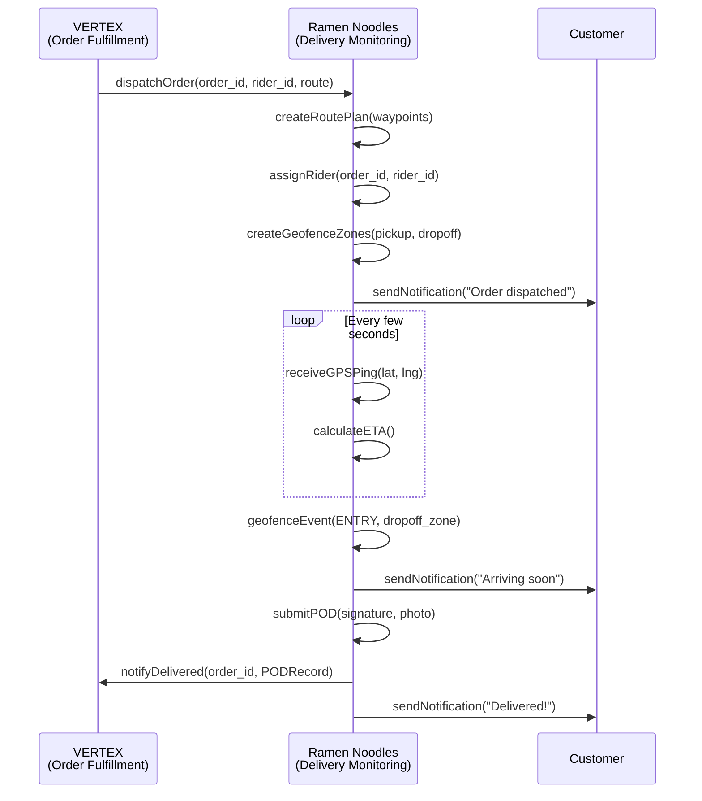
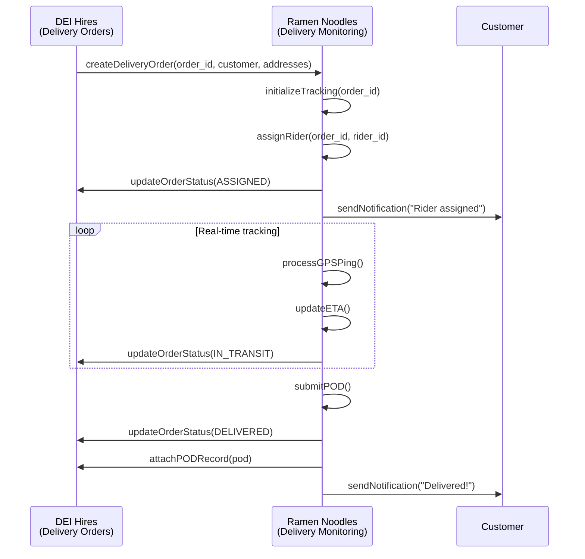
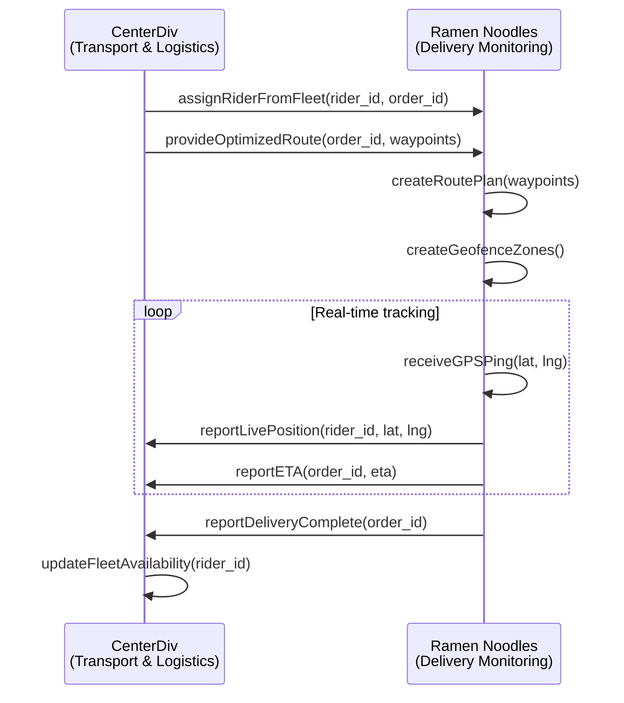
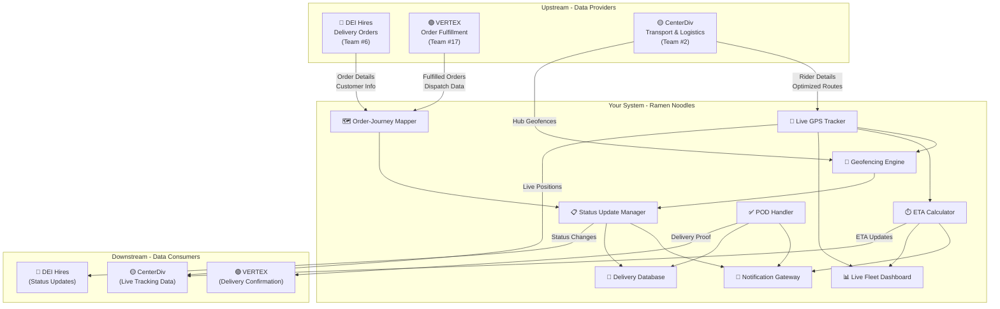

# 🍜 Ramen Noodles — Real-Time Delivery Monitoring
## OOAD Project: Subsystem Integration Analysis

> [!IMPORTANT]
> Your subsystem (**Real-Time Delivery Monitoring**, Team #9, Sub-system #7) needs to integrate with **2-3 other teams**. This document analyzes all 16 other subsystems and recommends the best integration partners.

---

## 📋 All Teams & Subsystems

| Team # | Team Name | Sub# | Subsystem |
|--------|-----------|------|-----------|
| 1 | CleanCode | 9 | Multi-level Pricing & Discount Management |
| 2 | CenterDiv | 6 | Transport & Logistics Management |
| 3 | NPCs | 17 | Exception Handling |
| 4 | Travelling Salesmen | 3 | Product Advancement & Returns Management |
| 5 | Design Drifters | 15 | Database Design |
| 6 | DEI Hires | 13 | Delivery Orders |
| 7 | D-UML | 14 | Packing, Repairs, Receipt Management |
| 8 | TeamNumber8 | 5 | Reporting & Analytics Dashboard |
| 9 | **Ramen Noodles (YOU)** | **7** | **Real-Time Delivery Monitoring** |
| 10 | Nova | 11 | Barcode Reader & RFID Tracker |
| 11 | Better Call Objects | 1 | Inventory Management |
| 12 | Team Rocket | 10 | Multi-tier Commission Tracking |
| 13 | Axion | 2 | Warehouse Management |
| 14 | Team Oopsie | 8 | Demand Forecasting |
| 15 | T3N50R | 16 | UI for the whole application |
| 16 | Team TankR.A.O | 12 | Double-entry Stock Keeping |
| 17 | VERTEX | 4 | Order Fulfillment |

---

## 🎯 Recommended Integration Partners (Top 3)

After analyzing all subsystems against your class diagram and component architecture, here are the **strongest integration candidates** ranked by relevance:

---

### 🥇 1. Team #17 — VERTEX (Order Fulfillment) ⭐⭐⭐⭐⭐

**Why this is your #1 integration partner:**

Order Fulfillment is the **direct upstream** process to delivery monitoring. An order must be fulfilled (picked, packed, dispatched) before your system can track it.

**Integration Points:**

| Your Component | Their Component | Data Exchanged | Direction |
|---|---|---|---|
| `Order` class | Order Fulfillment Engine | `order_id`, `customer_id`, `pickup_address`, `dropoff_address` | **VERTEX → You** |
| `OrderRiderMapping` | Dispatch/Assignment | `rider_id`, `order_id`, `assigned_at` | **VERTEX → You** |
| `RoutePlan` | Route Optimization | `waypoints`, `order_id` | **Bidirectional** |
| `DeliveryStatusLog` | Fulfillment Status | Status updates (`dispatched`, `in_transit`) | **You → VERTEX** |
| `PODRecord` | Order Completion | `signature_url`, `photo_url`, `submitted_at` | **You → VERTEX** |

**Interface Design (Java):**
```java
// Interface that VERTEX exposes for your system to consume
public interface IOrderFulfillmentService {
    Order getOrderDetails(String orderId);
    List<Order> getDispatchedOrders();
    void notifyOrderPickedUp(String orderId, String riderId);
    void notifyOrderDelivered(String orderId, PODRecord pod);
}

// Interface YOUR system exposes for VERTEX to consume
public interface IDeliveryTrackingService {
    GPSPing getCurrentLocation(String riderId);
    ETARecord getEstimatedArrival(String orderId);
    DeliveryStatusLog getLatestStatus(String orderId);
    String getTrackingURL(String orderId);
}
```

**Sequence Diagram:**


---

### 🥈 2. Team #6 — DEI Hires (Delivery Orders) ⭐⭐⭐⭐⭐

**Why this is your #2 integration partner:**

Delivery Orders is the **most tightly coupled** subsystem. Your `Order` class directly depends on delivery order creation. They create the delivery orders; you monitor and track them in real-time.

**Integration Points:**

| Your Component | Their Component | Data Exchanged | Direction |
|---|---|---|---|
| `Order` class | Delivery Order Creation | `order_id`, `customer_id`, `pickup/dropoff_address` | **DEI Hires → You** |
| `Customer` class | Customer Info | `customer_id`, `name`, `email`, `phone` | **DEI Hires → You** |
| `DeliveryStatusLog` | Order Status Updates | `status`, `changed_at`, `trigger_source` | **You → DEI Hires** |
| `NotificationLog` | Delivery Notifications | `channel`, `message`, `sent_at` | **You → DEI Hires** |
| `PODRecord` | Delivery Confirmation | `pod_id`, `signature_url`, `submitted_at` | **You → DEI Hires** |

**Interface Design (Java):**
```java
// Interface that DEI Hires exposes
public interface IDeliveryOrderService {
    DeliveryOrder createDeliveryOrder(String customerId, String pickup, String dropoff);
    DeliveryOrder getDeliveryOrder(String orderId);
    Customer getCustomerDetails(String customerId);
    void updateOrderStatus(String orderId, OrderStatus status);
}

// Interface YOUR system exposes for DEI Hires
public interface IDeliveryMonitoringService {
    void startTracking(String orderId, String riderId);
    OrderStatus getCurrentStatus(String orderId);
    ETARecord getETA(String orderId);
    PODRecord getProofOfDelivery(String orderId);
    List<NotificationLog> getNotificationHistory(String orderId);
}
```

**Sequence Diagram:**


---

### 🥉 3. Team #2 — CenterDiv (Transport & Logistics Management) ⭐⭐⭐⭐

**Why this is your #3 integration partner:**

Transport & Logistics handles **advanced routing, drop-shipping, and fleet management** — directly complementary to your GPS tracking, geofencing, and route planning components.

**Integration Points:**

| Your Component | Their Component | Data Exchanged | Direction |
|---|---|---|---|
| `Rider` class | Fleet/Driver Registry | `rider_id`, `vehicle_type`, `status` | **CenterDiv → You** |
| `Device` class | Vehicle Tracking Devices | `device_id`, `rider_id` | **Bidirectional** |
| `RoutePlan` | Advanced Routing Engine | `waypoints`, optimized routes | **CenterDiv → You** |
| `GPSPing` | Vehicle Telemetry | `latitude`, `longitude`, `timestamp` | **You → CenterDiv** |
| `GeofenceZone` | Logistics Zones | Hub/warehouse geofence boundaries | **CenterDiv → You** |
| `ETARecord` | Logistics Planning | `estimated_arrival`, `traffic_factor` | **You → CenterDiv** |

**Interface Design (Java):**
```java
// Interface CenterDiv exposes
public interface ITransportLogisticsService {
    Rider getRiderDetails(String riderId);
    List<Rider> getAvailableRiders(String zone);
    RoutePlan calculateOptimalRoute(String pickup, String dropoff, List<String> waypoints);
    List<GeofenceZone> getLogisticsHubZones();
    void reportVehicleHealth(String riderId, VehicleHealthReport report);
}

// Interface YOUR system exposes for CenterDiv
public interface IRealTimeTrackingService {
    GPSPing getLatestPosition(String riderId);
    List<GPSPing> getLocationHistory(String riderId, DateTime start, DateTime end);
    ETARecord getETA(String orderId);
    boolean isRiderInZone(String riderId, String zoneId);
    FleetOverview getLiveFleetDashboard();
}
```

**Sequence Diagram:**


---

## 📊 Integration Architecture Overview



---

## 🔗 Shared Data Models (Classes Used Across Subsystems)

These classes from your class diagram have direct touchpoints with other teams:

### Classes Shared with VERTEX (Order Fulfillment)
| Class | Shared Fields | Usage |
|---|---|---|
| `Order` | `order_id`, `customer_id`, `status`, `pickup_address`, `dropoff_address` | Order lifecycle management |
| `PODRecord` | `pod_id`, `order_id`, `signature_url`, `photo_url` | Delivery completion confirmation |
| `DeliveryStatusLog` | `order_id`, `status`, `changed_at` | Status synchronization |

### Classes Shared with DEI Hires (Delivery Orders)
| Class | Shared Fields | Usage |
|---|---|---|
| `Order` | `order_id`, `customer_id`, `status` | Order creation and tracking |
| `Customer` | `customer_id`, `name`, `email`, `phone` | Customer notifications |
| `NotificationLog` | `order_id`, `customer_id`, `channel`, `message` | Delivery notifications |

### Classes Shared with CenterDiv (Transport & Logistics)
| Class | Shared Fields | Usage |
|---|---|---|
| `Rider` | `rider_id`, `name`, `vehicle_type`, `status` | Fleet management |
| `Device` | `device_id`, `rider_id` | Tracking device registry |
| `GPSPing` | `device_id`, `rider_id`, `latitude`, `longitude` | Real-time location data |
| `RoutePlan` | `route_id`, `order_id`, `waypoints` | Route coordination |

---

## 🛠️ Implementation Approach

### Design Patterns Recommended

1. **Observer Pattern** — For real-time status updates between subsystems
   ```java
   public interface DeliveryStatusObserver {
       void onStatusChanged(String orderId, OrderStatus newStatus);
       void onLocationUpdated(String riderId, GPSPing ping);
       void onETAUpdated(String orderId, ETARecord eta);
   }
   ```

2. **Facade Pattern** — Each team exposes a single service interface
   ```java
   public class DeliveryMonitoringFacade {
       private LiveGPSTracker gpsTracker;
       private GeofencingEngine geofenceEngine;
       private ETACalculator etaCalculator;
       private StatusUpdateManager statusManager;
       
       // Single entry point for other subsystems
       public DeliveryOverview getDeliveryOverview(String orderId) { ... }
       public void startTracking(String orderId) { ... }
       public void stopTracking(String orderId) { ... }
   }
   ```

3. **Strategy Pattern** — For notification channels (SMS/Email)
   ```java
   public interface NotificationStrategy {
       void send(String customerId, String message);
   }
   
   public class SMSNotification implements NotificationStrategy { ... }
   public class EmailNotification implements NotificationStrategy { ... }
   ```

---

## 📝 Summary

| Rank | Team | Subsystem | Integration Type | Strength |
|------|------|-----------|-----------------|----------|
| 🥇 | VERTEX (#17) | Order Fulfillment | Upstream → Downstream | ⭐⭐⭐⭐⭐ |
| 🥈 | DEI Hires (#6) | Delivery Orders | Tightly Coupled | ⭐⭐⭐⭐⭐ |
| 🥉 | CenterDiv (#2) | Transport & Logistics | Bidirectional | ⭐⭐⭐⭐ |

> [!TIP]
> **Honorable mentions** that could also work:
> - **TeamNumber8 (#8)** — Reporting & Analytics Dashboard: Your tracking data feeds their reports
> - **Nova (#10)** — Barcode Reader & RFID: Package scanning triggers your status updates
> - **Axion (#13)** — Warehouse Management: Warehouse dispatch starts your tracking flow

These 3 teams provide the most **natural, logical data flow** in a real supply chain:
1. **Delivery Orders** creates the order → 
2. **Order Fulfillment** picks, packs, dispatches → 
3. **Your system** tracks in real-time → 
4. **Transport & Logistics** manages fleet and routes
